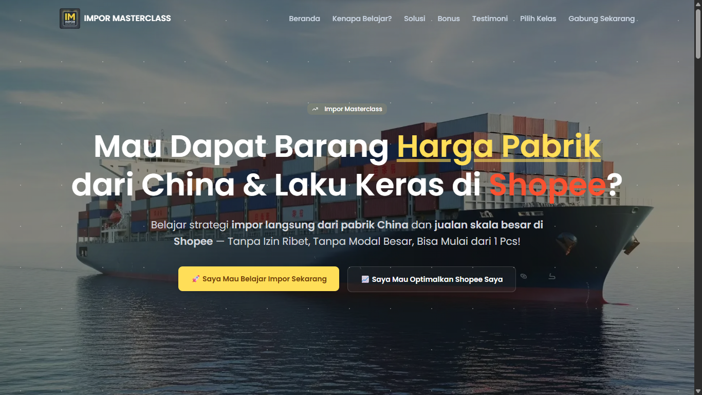

<div align="center">

# 🚀 Captstone Project – Landing Page


**Impor Masterclass** adalah landing page modern & responsif untuk program belajar impor langsung dari pabrik China dan optimasi penjualan di Shopee.  
Website ini dirancang dengan **Next.js + TypeScript** serta mengutamakan performa, SEO, dan user experience.


[](https://capstone.dobda.id)

</div>

---

## ✨ Konten Website

- 🎯 **Hero Section** – Ajakan belajar impor langsung dari pabrik dengan CTA yang jelas.
- 🛑 **Problem Section** – Menampilkan masalah umum pebisnis impor & seller Shopee.
- 🔑 **Solusi Section** – Menawarkan solusi lewat masterclass lengkap dengan tools & komunitas.
- 🎁 **Bonus Section** – Bonus eksklusif: kalkulator HPP, template chat Mandarin, database supplier, dsb.
- 💰 **Simulasi Cuan** – Perhitungan potensi profit dari produk impor.
- 💬 **Testimoni** – Cerita sukses member yang sudah ikut.
- 🎯 **Learning Path** – Dua jalur: _Impor Masterclass_ & _ScaleUp Master Shopee_.

## 🛠️ Teknologi yang Digunakan

<div align="left">

### 🧠 AI Development Stack

 

### 🚀 Frontend Stack


</div>

## 📚 Cara Menjalankan Proyek

### Prasyarat

[](https://nodejs.org/) [](https://pnpm.io/installation)

### Instalasi

```bash
git clone https://github.com/irwanx/captstone-project.git
```

```bash
cd captstone-project
```

```bash
pnpm install
```

### Development Server

```bash
pnpm dev
```

🎉 Buka [http://localhost:3000](http://localhost:3000) di browser.

## 📦 Deployment

[](https://vercel.com/new)

## 📁 Struktur Proyek

```text
.
├─ app/                          # App Router, halaman, layout, loading, not-found
│  ├─ globals.css                # Global styles (Tailwind CSS 4)
│  ├─ layout.tsx                 # Root layout + Theme provider
│  ├─ loading.tsx                # Skeleton/loading UI
│  ├─ not-found.tsx              # 404 page
│  └─ page.tsx                   # Halaman landing utama
│
├─ assets/                       # Aset non-public (di-import via bundler)
│  ├─ homepage.png
│  └─ images/
│     ├─ hero-image.webp
│     ├─ profile-avatar.jpg
│     └─ ...
│
├─ components/                   # Komponen UI terstruktur per domain
│  ├─ elements/                  # Elemen kecil: overlay, share, social links
│  ├─ icons/                     # Ikon React (lucide/custom)
│  ├─ layouts/                   # Layout-level: Navbar, Footer
│  ├─ sections/                  # Bagian halaman: Hero, Testimonial, dst.
│  ├─ themes/                    # Theme provider & mode toggle
│  └─ ui/                        # Shadcn/UI primitives (button, card, table, ...)
│
├─ constants/                    # Konstanta konfigurasi
│  └─ config.ts
│
├─ hooks/                        # Hooks utilitas
│  └─ DevToolsBlocker.tsx
│
├─ lib/                          # Utilitas non-UI
│  └─ utils.ts
│
├─ public/                       # Aset publik langsung (favicon, icons, sitemap)
│  ├─ site.webmanifest
│  ├─ sitemap.xml
│  └─ ...
│
├─ middleware.ts                 # Middleware Next.js
├─ next-sitemap.config.js        # Konfigurasi next-sitemap
├─ next.config.ts                # Konfigurasi Next.js
├─ eslint.config.mjs             # ESLint config
├─ postcss.config.mjs            # PostCSS config (Tailwind CSS 4)
├─ tsconfig.json                 # TypeScript config
├─ package.json                  # Scripts & dependencies
└─ README.md
```

## 🔄 Alur Data & Rendering

- **Routing & Layout**: `app/layout.tsx` membungkus semua rute; `app/page.tsx` adalah landing utama.
- **Rendering**: Default menggunakan Server Components; komponen interaktif diberi `"use client"`.
- **Styling**: Tailwind CSS 4 via `app/globals.css` dan utility-first classes pada komponen.
- **Middleware**: `middleware.ts` dieksekusi sebelum routing untuk logika ringan/redirect.
- **SEO**: `next-sitemap` menghasilkan `sitemap.xml` dan `robots.txt` saat post-build.
- **Assets**: Gambar publik disajikan dari `public/`, aset yang di-import dari `assets/` diproses bundler.

## 🧰 Kualitas Kode & Standar

- **ESLint**: Aturan berbasis `eslint-config-next` + ESLint v9.
- **Prettier**: Konsistensi format kode.
- **TypeScript**: Strict typing untuk keandalan dan DX lebih baik.
- **Komponen**: Nama jelas, pemisahan Server/Client, hindari side-effect di Server Components.

Perintah:

```bash
pnpm lint            # Jalankan ESLint
pnpm format          # Format seluruh repo via Prettier
pnpm format:check    # Cek format tanpa menulis perubahan
```

## 📜 Scripts

```bash
pnpm dev            # Jalankan dev server (Turbopack)
pnpm build          # Build produksi
pnpm start          # Jalankan server produksi
pnpm postbuild      # Generate sitemap/robots via next-sitemap
pnpm lint           # ESLint
pnpm format         # Prettier write
pnpm format:check   # Prettier check
```

---

## 📄 Lisensi

Proyek ini dilisensikan di bawah Lisensi MIT. Lihat file [LICENSE](LICENSE) untuk detailnya.
